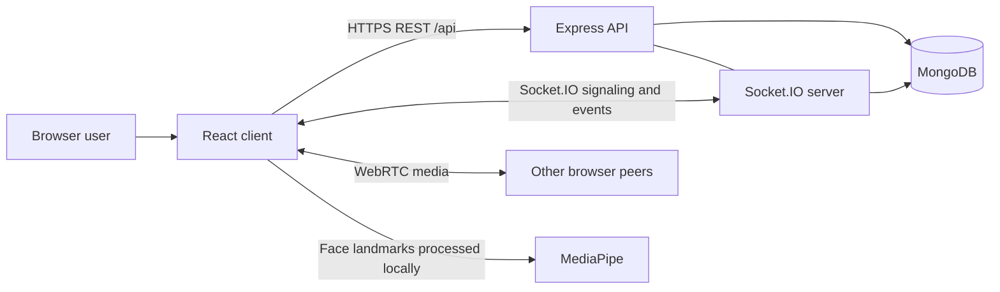

# ThirdEye Server

The REST and real-time backend for ThirdEye, an online classroom platform with WebRTC video, classroom controls, chat, engagement analytics, and role-based administration.

This repository is the backend half of ThirdEye. It serves an Express API and Socket.IO from one HTTP server and stores durable state in MongoDB.

## Features

- Student, instructor, and administrator authentication with JWTs
- Session scheduling, enrollment, start/end lifecycle, and room codes
- WebRTC signaling and live participant state through Socket.IO
- Persistent classroom chat
- Storage and aggregation of client-generated engagement measurements
- Per-session time series, student breakdowns, and heatmaps
- Platform-wide administrative metrics
- Swagger UI in non-production environments

## Architecture



The server never handles WebRTC audio or video. It relays signaling and classroom events, while browsers exchange media directly. Engagement inference occurs in the student browser; the server stores derived measurements and produces analytics.

See [Architecture](docs/ARCHITECTURE.md) and [Real-time events](docs/REALTIME_EVENTS.md) for complete flows and contracts.

## Requirements

- Node.js 20 or newer (a current LTS release is recommended)
- npm
- MongoDB 6 or newer, locally or through MongoDB Atlas
- A separately running ThirdEye client

## Setup

```bash
git clone <server-repository-url>
cd server
npm install
cp .env.example .env
npm run dev
```

Update `.env` with a reachable MongoDB URI and a strong JWT secret. The server defaults to `http://localhost:5000`; the client development server defaults to `http://localhost:5173`.

Check the service at `GET http://localhost:5000/api/health`. In development, browse the partial OpenAPI reference at `http://localhost:5000/api/docs`.

## Environment configuration

| Variable | Required | Description | Default/example |
| --- | --- | --- | --- |
| `PORT` | No | HTTP and Socket.IO port | `5000` |
| `MONGO_URI` | Yes | MongoDB connection string and database | `mongodb://127.0.0.1:27017/thirdeye` |
| `JWT_SECRET` | Yes | Secret used to sign and verify JWTs | Use a long random value |
| `JWT_EXPIRES_IN` | No | JWT lifetime accepted by `jsonwebtoken` | `7d` |
| `CLIENT_URL` | Yes in production | Exact allowed browser origin for REST and Socket.IO CORS | `http://localhost:5173` |
| `NODE_ENV` | No | Enables production cookie behavior and hides Swagger | `development` |

Do not commit `.env`. In production, `CLIENT_URL` must include the scheme and host and must not contain a path. When `NODE_ENV=production`, cookies are `Secure`, `httpOnly`, and `SameSite=None`, so both applications must use HTTPS.

## MongoDB

MongoDB is the durable source of truth. For a local instance:

```dotenv
MONGO_URI=mongodb://127.0.0.1:27017/thirdeye
```

For Atlas, create a database user, permit the server's network address, and copy the driver connection string into `MONGO_URI`. Percent-encode special characters in credentials. The server connects before it starts listening; a missing or failed connection stops startup.

Mongoose creates collections and declared indexes as models are used. Production teams should manage index changes explicitly rather than relying on automatic synchronization.

## Scripts

| Command | Purpose |
| --- | --- |
| `npm run dev` | Run TypeScript through `ts-node` with Nodemon reloads |
| `npm run build` | Compile TypeScript into `dist/` |
| `npm start` | Run the compiled `dist/index.js` server |

## Authentication and authorization

Registration and login return a user and JWT and set the JWT in an httpOnly `token` cookie. The middleware also accepts a bearer token, supporting clients affected by cross-site cookie restrictions. Passwords are hashed with bcrypt.

Roles are `student`, `instructor`, and `admin`:

- Students browse sessions, enroll, join rooms, and contribute engagement data.
- Instructors create and control their own sessions and view detailed analytics.
- Administrators access platform reporting and may create sessions, but ownership checks still apply to start/end operations.

Protected REST requests must include either the cookie or `Authorization: Bearer <jwt>`. Socket.IO currently has no equivalent authentication middleware; see [Security boundary](docs/ARCHITECTURE.md#operational-and-security-boundaries).

## REST API

All endpoints return JSON. Protected endpoints require authentication.

### Health and authentication

| Method | Path | Access | Purpose |
| --- | --- | --- | --- |
| `GET` | `/api/health` | Public | Health and timestamp |
| `POST` | `/api/auth/register` | Public | Create a user and sign in |
| `POST` | `/api/auth/login` | Public | Verify credentials and sign in |
| `GET` | `/api/auth/me` | Authenticated | Current user |
| `POST` | `/api/auth/logout` | Authenticated | Clear the authentication cookie |

### Sessions and analytics

| Method | Path | Access | Purpose |
| --- | --- | --- | --- |
| `GET` | `/api/sessions` | Authenticated | Role-filtered sessions |
| `POST` | `/api/sessions` | Instructor/admin | Create a scheduled session |
| `GET` | `/api/sessions/:id` | Authenticated | Session detail |
| `POST` | `/api/sessions/:id/enroll` | Student | Enroll in a scheduled/active session |
| `PATCH` | `/api/sessions/:id/start` | Owning instructor | Create room and activate session |
| `PATCH` | `/api/sessions/:id/end` | Owning instructor | Complete active session |
| `GET` | `/api/sessions/:sessionId/analytics` | Authenticated | Aggregate session analytics |
| `GET` | `/api/sessions/:sessionId/analytics/student/:studentId` | Instructor | Student time series |
| `GET` | `/api/sessions/:sessionId/analytics/heatmap` | Instructor | Student-by-minute matrix |

### Rooms and administration

| Method | Path | Access | Purpose |
| --- | --- | --- | --- |
| `GET` | `/api/rooms/:roomCode` | Authenticated | Room and associated session |
| `POST` | `/api/rooms/:roomCode/save-record` | Enrolled user | Store a derived engagement sample |
| `GET` | `/api/rooms/:roomCode/chat-history` | Authenticated | Latest 50 messages, chronological |
| `GET` | `/api/admin/stats` | Admin | Platform metrics |
| `GET` | `/api/admin/users` | Admin | User listing |
| `GET` | `/api/admin/sessions` | Admin | Platform session listing |

Swagger annotations provide request/response detail for many, but not yet all, endpoints at `/api/docs` outside production.

## Socket.IO

Socket.IO uses the default namespace on the same HTTP server. It handles:

- WebRTC offer, answer, and ICE-candidate relay
- Join, leave, participant media state, hand raising, and screen sharing
- Instructor permissions and force mute/unmute controls
- Ephemeral live engagement labels
- Persistent chat broadcasting
- Session-ended notification

The authoritative payload table is in [Real-time events](docs/REALTIME_EVENTS.md).

## Data models

| Model | Important fields | Relationships |
| --- | --- | --- |
| `User` | name, unique email, password hash, role, avatar color | Instructs/enrolls in sessions; sends messages and samples |
| `Session` | title, instructor, students, start/duration/end, status, room code | Has zero or one room and many engagement records |
| `Room` | unique session, unique room code, lock/end state | Contains chat messages |
| `ChatMessage` | room, sender, sender name, content, timestamp | Belongs to a room and user |
| `EngagementRecord` | session, student, label, confidence, model, face stats, timestamp | Belongs to a session and user |

Session states are `scheduled`, `active`, `completed`, and `expired`. Engagement labels are `very_low`, `low`, `high`, and `very_high`.

## Production deployment

```bash
npm install
npm run build
NODE_ENV=production npm start
```

Provide all environment variables through the hosting platform. The deployment must:

- Reach MongoDB over TLS and keep credentials secret.
- Serve HTTPS and support WebSocket upgrades and long-lived connections.
- Set `CLIENT_URL` to the exact deployed frontend origin.
- Keep at least one continuously available process; live room state is lost on restart.
- Use sticky sessions plus a shared Socket.IO adapter and shared room state when scaling horizontally.
- Terminate gracefully and monitor `/api/health`.

The API has no built-in process manager or container definition. Run `dist/index.js` under the platform's supervised Node process.

## Project structure

```text
src/
  config/       Database and Swagger configuration
  controllers/  REST business logic and analytics
  middleware/   JWT and role checks
  models/       Mongoose schemas
  routes/       Express route definitions
  socket/       Signaling, classroom state, and chat
  index.ts      HTTP server composition and startup
```

## Related documentation

- [System architecture](docs/ARCHITECTURE.md)
- [Socket.IO real-time events](docs/REALTIME_EVENTS.md)

