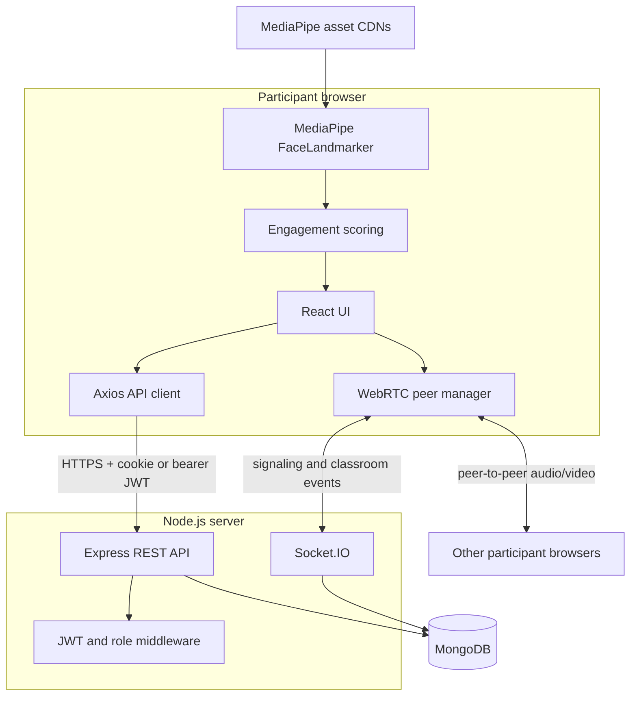
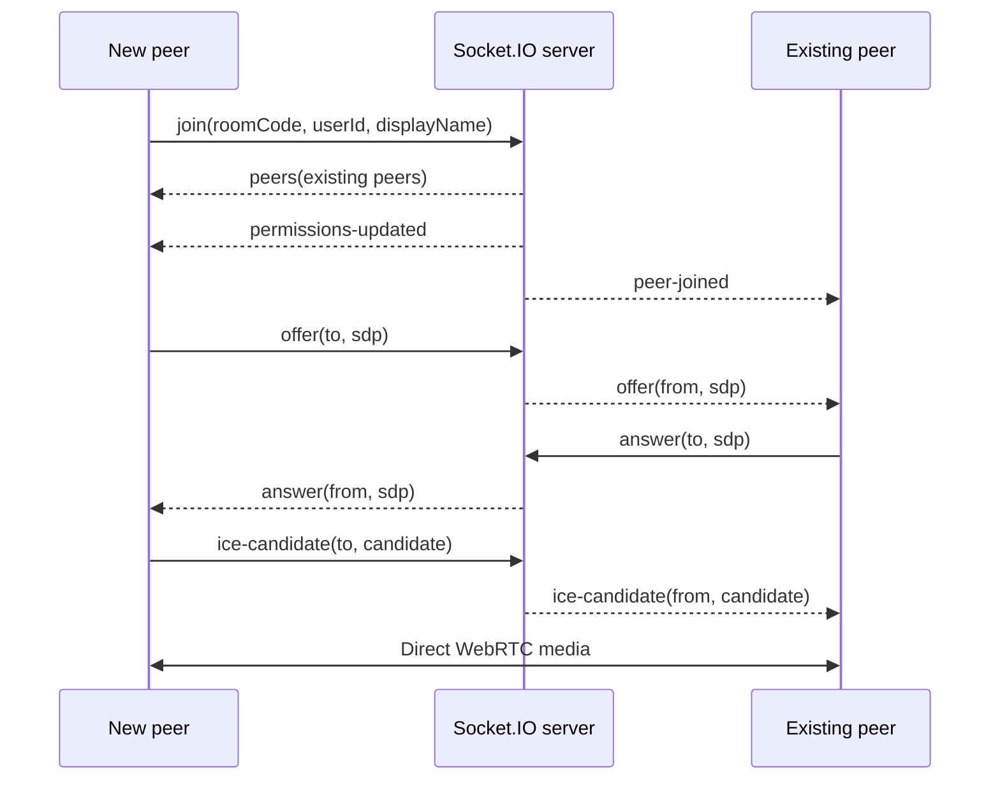
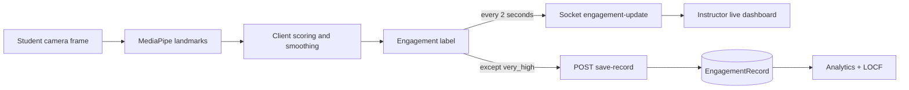
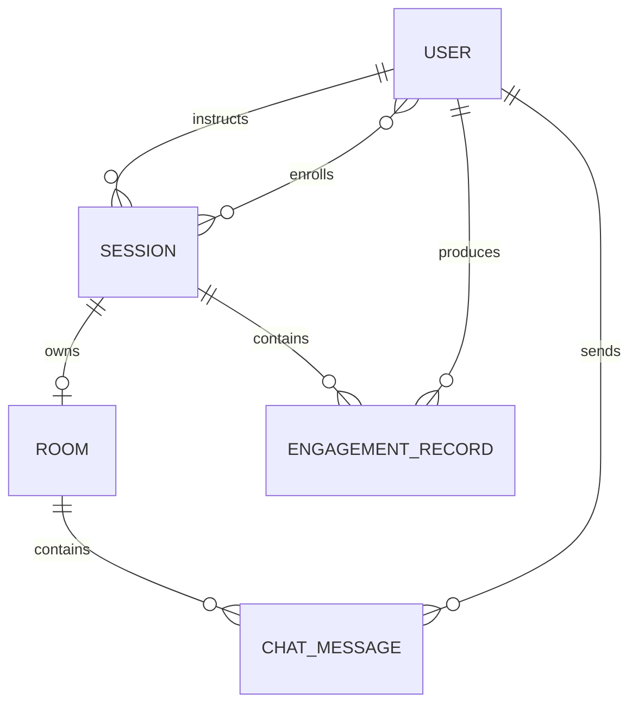

# ThirdEye Architecture

ThirdEye is split into independent React client and Node.js server repositories. This document describes the complete system from the server repository's perspective.

## System context



Express owns durable operations: authentication, sessions, room validation, enrollment, engagement storage, analytics, chat history, and administration. Socket.IO relays signaling and live events. The React client captures media and performs engagement inference. MongoDB stores durable state.

## Authentication flow

```mermaid
sequenceDiagram
    participant B as Browser
    participant A as Express API
    participant D as MongoDB
    B->>A: POST /api/auth/login
    A->>D: Find user and verify bcrypt hash
    D-->>A: User
    A-->>B: User + JWT; set httpOnly cookie
    B->>A: Protected request with cookie or Bearer token
    A->>A: Verify JWT and required role
    A->>D: Read or mutate data
    D-->>A: Result
    A-->>B: JSON response
```

Production cookies are `Secure`, `SameSite=None`, and httpOnly. Development uses `SameSite=Lax`. REST authorization is applied through `protect` and `requireRole` middleware, with additional ownership checks in controllers.

## Session and room lifecycle

1. An instructor creates a `scheduled` session.
2. Students enroll explicitly or are auto-enrolled when joining the Socket.IO room.
3. The owning instructor starts the session. Express generates a code such as `ABC-XYZ-123`, changes status to `active`, and creates a one-to-one `Room`.
4. Participants validate the room over REST and join its Socket.IO group.
5. The instructor ends the durable session with REST, then emits `end-session`. Express records `completed` and end times; Socket.IO notifies peers and clears in-memory state.

## WebRTC signaling



SDP and ICE payloads are opaque to the server. The topology is a browser mesh, so CPU and bandwidth grow with participant count. The server holds peers and room permissions in memory. Horizontal scaling requires a shared Socket.IO adapter and state store, typically Redis; reliable restrictive-network support also requires TURN.

## Engagement processing



Raw camera frames are not sent to this server for engagement analysis. The browser derives face landmarks and scores eye openness, gaze, head yaw, centering, and face size. It emits the latest label for live display. To reduce storage, `very_high` samples are not persisted; other labels and derived face statistics are authenticated and stored. Historical analytics use last observation carried forward (LOCF), so a missing record does not necessarily indicate missing monitoring.

## Persistence model



- `User`: identity, bcrypt hash, role, and avatar color.
- `Session`: instructor, enrolled students, timing, status, and room code.
- `Room`: one-to-one live-room metadata and end time.
- `ChatMessage`: room, sender, denormalized sender name, content, and timestamp.
- `EngagementRecord`: session, student, label, confidence, model, derived face statistics, and timestamp.

## Operational and security boundaries

- MongoDB is durable; live peer and permission maps are ephemeral and process-local.
- REST and Socket.IO share one HTTP server and one allowed `CLIENT_URL` origin.
- Swagger UI exists only when `NODE_ENV` is not `production`.
- Socket.IO currently does not verify a JWT handshake or independently authorize instructor-only events. Harden it by authenticating the handshake, binding verified identity and role to `socket.data`, validating payload schemas, and checking room membership and ownership for each event.
- Chat sender identity currently comes from the event payload and should instead come from verified socket state.
- Rate limiting, structured validation, CSRF protection, shared real-time state, and automated tests are not currently present and should be considered before an untrusted production launch.

